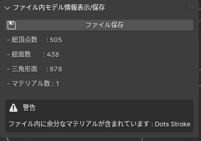
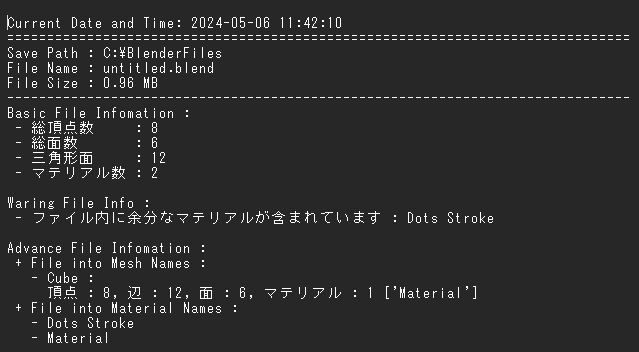

display_model_info.md (ファイル内モデル情報表示/保存)
==================

機能概要
------------------

Blenderモデリングプロジェクトの整合性を確認し、問題がある場合にはエラーメッセージを生成するメソッドを含んでいます。

- 編集中ファイルの情報をパネルに表示
  - 内のメッシュ情報を表示
    - 総頂点数
    - 総面数
    - 三角形面
    - マテリアル数
  - メッシュ情報に留意がある場合はその旨を警告として表示
- 「ファイル保存」ボタン押下によりメッシュ情報をファイル保存
- 編集中ファイル保存(Ctrl + S)時にメッシュ情報をファイル保存

ファイル保存について
------------------

パネル内の「ファイル保存」ボタン押下、及びファイル保存(Ctrl + S等)時に、以下の情報ファイルを[作成|上書]保存する

- ファイル名: `%編集中ファイル名%_info.txt`
- ファイル保存先: `%編集中ファイル保存先パス%`

- メッシュ情報ファイル
  - ファイル形式: テキストファイル
  - ファイル内容: メッシュ情報

表示警告の一覧
------------------

None

更新履歴
------------------

None
